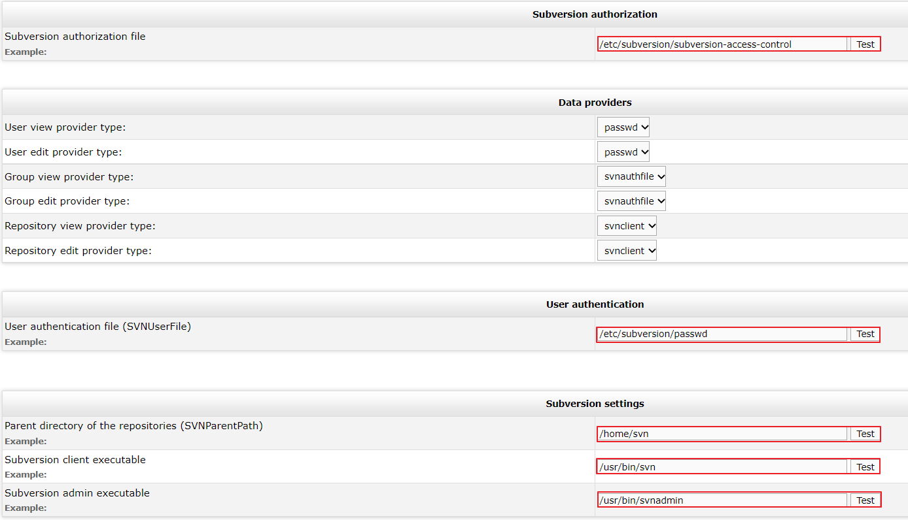

# 도커 개발 환경 설정

- choco 

> choco를 활용하여 설치한경우 docker-users 그룹에 포함이 되지 않아 실행 오류가 날 경우 
> 아래 명령어를 이용해 그룹 추가를 해주면 사용 가능함

```bash
> net localgroup docker-users ldcc /add
```

---

- 도커 이미지 다운로드 목록 (계속 추가 예정)

```bash
docker pull jenkins:2.60.3
docker pull oraclelinux:7
docker pull mysql:8.0.29
docker pull elleflorio/svn-server:latest
```

---

- 도커 컨테이너 생성 명령어

```bash
# 젠킨스
docker run --name jenkins -itd -p 8080:8080 jenkins/jenkins:jdk11
# 오라클 리눅스
docker run --name oraclelinux7 -itd -p 1521:1521 oraclelinux:7
# 오라클 12c
docker run --name oracle12c -itd -p 1521:1521 -p 5500:5500 store/oracle/database-enterprise:12.2.0.1-slim
# svn
docker run -d --name svn-server -p 80:80 -p 3690:3690 elleflorio/svn-server
```

---

- Oracle12c 설정

```bash
# connection type: BASIC
# host: 127.0.0.1
# database: ORCLCDB >> and side combo must be at SID
# username: sys >> and side combo must be at SYSDBA
# password: Oradoc_db1


# 계정 생성 및 데이터베이스 생성
sql> create user 'DEV_MOS' identified by 'ORA!123';
sql> grant connect, resource, dba to 'DEV_MOS';

# 유저 생성시 ORA-65096 에러가 날 경우 실행 쿼리
sql> ALTER SESSION SET "_ORACLE_SCRIPT"=true;
```

---

- 사설 인증서 관련

```bash
# yum 통신 ssl 인증서 등록
cd /etc/pki/ca-trust/source/ 
run update-ca-trust extract

# 자바 사설 인증서 등록
keytool -importcert -file ./lotte_net.cer -alias lotte.net -keystore $JAVA_HOME/jre/lib/security/cacerts -storepass changeit
keytool -importcert -file ./lotte_net.cer -alias lotte.net -keystore /etc/ssl/certs/java -storepass changeit

# 자바 사설 인증서 목록 확인
keytool -list -keystore /etc/ssl/certs/java/cacerts -storepass changeit
```

---

- 도커 명령어 모음

```bash
# 도커 컨테이너 접속
docker exec -it jenkins /bin/bash

# 도커 컨테이너 내부 명령어 실행
docker exec jenkins cat /var/jenkins_home/secrets/initialAdminPassword

# 도커 컨테이너 파일 복사
## Host -> Container
docker cp C:\Users\ldcc\Downloads\lotte_net.cer jenkins:/tmp
docker cp C:\Users\ldcc\Downloads\lotte_net.cer oraclelinux7:/etc/pki/ca-trust/source/anchors/
docker cp D:\install_package\oracle\V46095-01_1of2.zip oraclelinux7:/tmp
docker cp D:\install_package\oracle\V46095-01_2of2.zip oraclelinux7:/tmp

## Container -> Host
docker cp jenkins:/etc/java-8-openjdk/security/java.security C:\Users\ldcc\Downloads

# 도커 컨테이너 root 접속
docker exec -u 0 -it jenkins /bin/bash

# 도커 컨테이너 로그 보기
docker logs jenkins -f
```

---

- svn 초기 설정

```
http://localhost/svnadmin
```



- wsl ubuntu 20.04 설치 후 podman 설치

```bash
# 저장소 추가
echo "deb https://download.opensuse.org/repositories/devel:/kubic:/libcontainers:/stable/xUbuntu_20.04/ /" |
sudo tee /etc/apt/sources.list.d/devel:kubic:libcontainers:stable.list

curl -L "https://download.opensuse.org/repositories/devel:/kubic:\
/libcontainers:/stable/xUbuntu_20.04/Release.key" | sudo apt-key add -

# 시스템 업그레이드
sudo apt-get update
sudo apt-get -y upgrade

# 업그레이드시 GPG 키 오류 발생시 아래 명령어로 키 등록
sudo apt-key adv --keyserver keyserver.ubuntu.com --recv-keys <PUBKEY>

# podman 설치
sudo apt install podman
```

- wsl ubuntu 20.04 설치 후 podman 구동시 WARN 메세지 해결법

```bash
sudo chmod 4755 /usr/bin/newgidmap
sudo chmod 4755 /usr/bin/newuidmap
```

- wsl ubuntu 20.04 cockpit error handling

```bash

```
